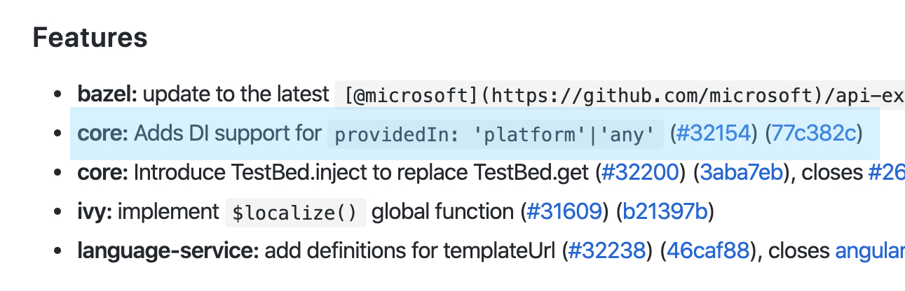
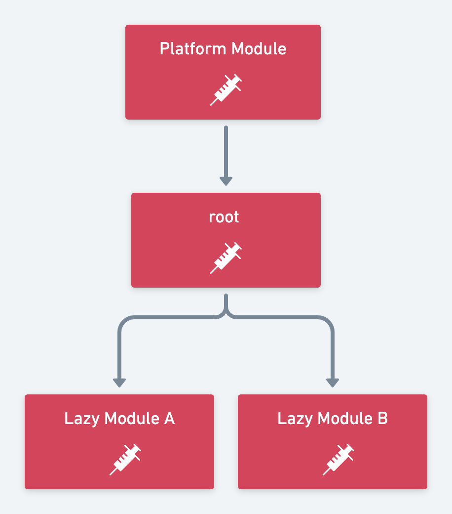
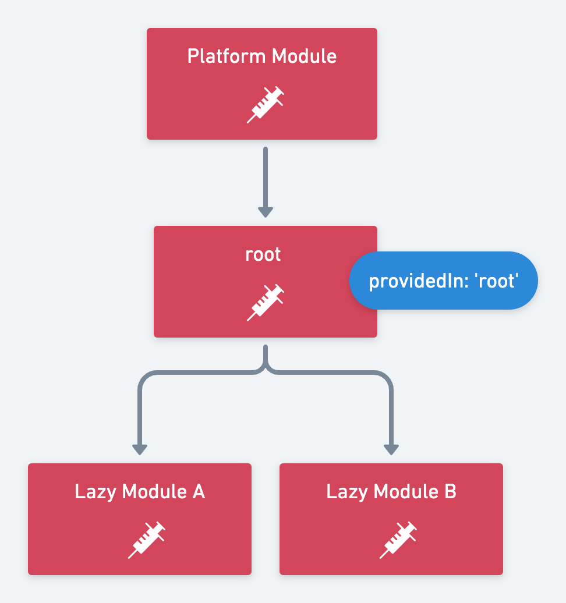
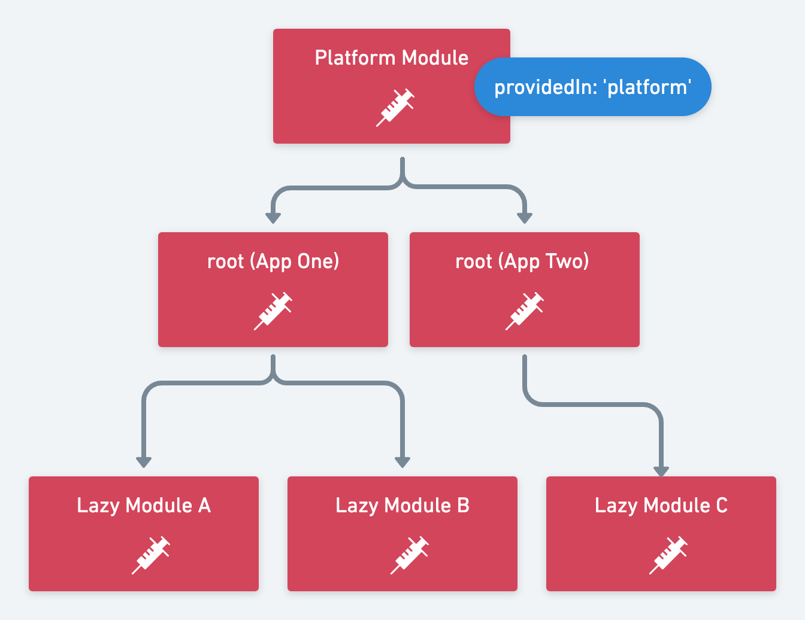
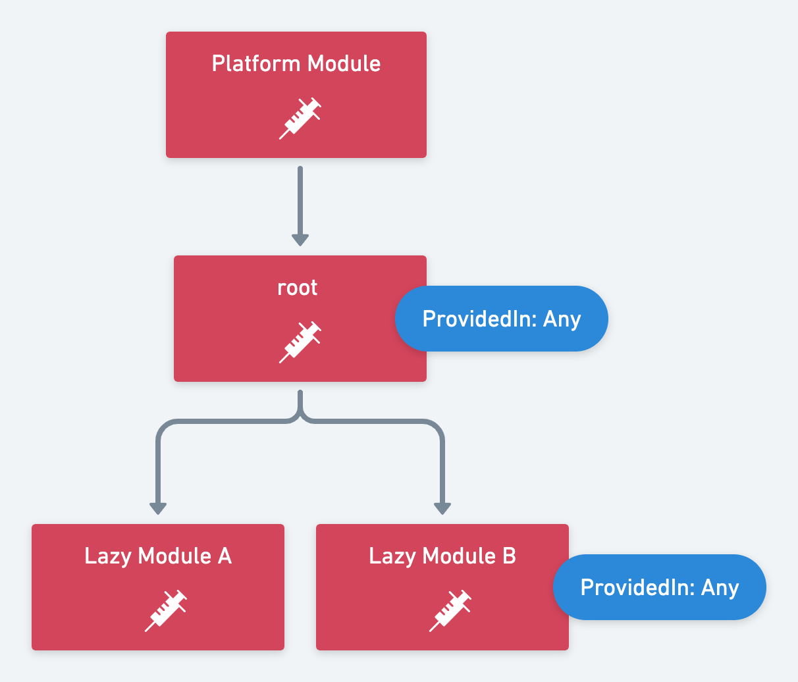

Have you looked at the changelog of Angular 9 and found the new functionality of providedIn and want to know what **'any'** and **'platform'** are for? In this article we look at the two new scopes of providedIn.



# tl;dr

**'platform'** and **'any'** are two new ways to define where a service should be resolved.

```typescript
@Injectable({
  providedIn: "root" | "any" | "platform"
})
export class MyService {}
```

- **'platform'** makes a service available between multiple apps or Angular Elements
- **'any'** creates isolated (not singleton) services for every child injector.

# Official Angular 9 documentation

The [offical documentation](https://next.angular.io/api/core/Injectable) describes the new scopes as follows:

- **'root'** injector, which will be the application-level injector in most apps.
- **'platform'** injector, which would be the special singleton platform injector shared by all applications on the page.
- **'any'** injector, which would be the injector which receives the resolution. (Note this only works on NgModule Injectors and not on Element Injector)

The documentation already gives us a good overview of the new scopes. In the next chapters I'll go into the individual scopes in more detail.

# Quick Angular DI recap

** Module Injectors **

There are two injector hierarchies in Angular:

- ModuleInjector
- ElementInjector (NodeInjector in Ivy)

See [Hierarchical injectors](https://angular.io/guide/hierarchical-dependency-injection)

In this article we only look at the ModuleInjectors.

A simplified visualization of the module injector hierachy would like this:



Your services are in one of those injectors (Most likely in the root injector).

- Platform Injector (special things like DomSanitizer)
- root Injector (main injector and place for all eagery loaded module providers)
- LazyModules Injectors (all lazy loaded modules create a child injector)

** Pre Angular 6 **

The only way to define providers was with the providers array. Services were singletons in eagerly loaded modules but could be instatiated multiple times with lazy loaded modules.

```typescript
@NgModule({
  providers: [MyService]
})
export class MyModule {}
```

** Angular 6+ **

Angular 6 introduced tree-shakable providers with providedIn: **'root'**.

```typescript
@Injectable({
  providedIn: "root"
})
export class MyService {}
```

This has 3 big advantages:

- Services are tree-shakable
- Services are singleton for the whole application, also for lazy loaded modules
- No need to explicitly register the service with a NgModule

If you want to know more about this, read the excellent [article](https://medium.com/@tomastrajan/total-guide-to-angular-6-dependency-injection-providedin-vs-providers-85b7a347b59f) by Tomas.

** Angular 9 ✨ **

Now with Angular 9 we have two new ways to define providedIn scopes:

- **any**
- **platform**

Let's have a look at them.

# ProvidedIn: root

Every service defined with **'root'** will be provided in the root injector and is a singleton for the whole application. Lazy modules will use the instance from root.



> providedIn: 'root' will still be the default choice for most services.

# ProvidedIn: platform

Every service defined with **'platform'** will be provided in the platform injector and is a singleton for all applications. Lazy modules will use the instance from platform.

The difference between **'root'** and **'platform'** is only noticeable when running multiple Angular application in the same window. Both make sure that only one singleton exists even for lazy loaded modules. But when running two applications in the same window, each application has it's own root injector but both share the platform injector.

This means that the best use case for **providedIn: 'platform'** is for sharing services over application boundaries. E.g. with Angular Elements.



> Use providedIn: 'platform' for sharing services over application boundaries. E.g. with Angular Elements.

# ProvidedIn: any

Every service defined with **'any'** will be provided in every module it is used. That means there might be multiple instances of the same service. That means that every lazy loaded module has it's own instance of the service. All eagerly loaded modules share one instance provided by the root module injector.

In the following example is the service used twice. Once within an eagerly loaded module (provided by root) and once in Lazy Module B (provided by its child injector).



What's really cool with that approach is, that you can make sure that a child injector always has it's own instance without the need to register the service in the providers list. 💪

# Summary

**'Root'** will still be the default for most services. It makes it very convenient to create tree-shakable services which are singleton within an application.

**'Platform'** is most likely used for creating shared services for Angular Elements. If you know another use case, please let me know an create a [PR on this article](https://github.com/ChristianKohler/Homepage/blob/master/content/posts/2019-12-15-ng9-providedin-any/index.md).

**'Any'** is very helpful to make sure a service is a singleton within module boundaries. It's a robust alternative to **'root'** to make sure the individual modules don't have a side effect on each other.

All in all a very welcome feature 🥳

👆 If you like the article follow me on [twitter](https://twitter.com/kohlerchristian) 🙌
