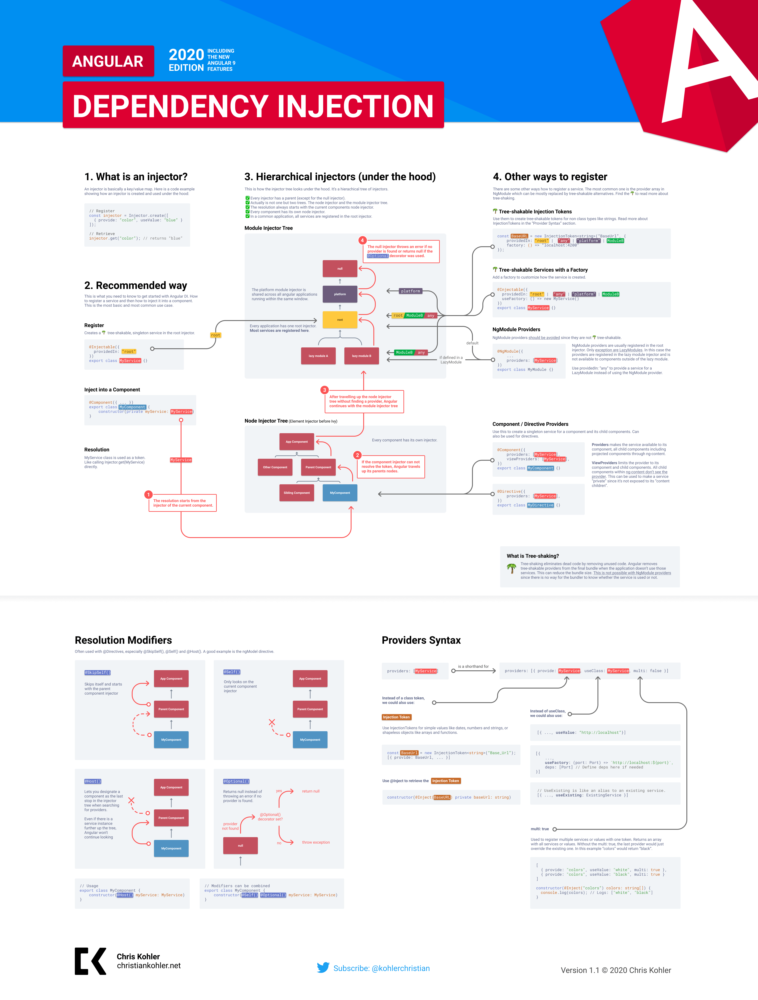

Angular has it's on dependency injection framework. It's very powerful and helps increase the effiency and modularity of your application. It's can also be quit complex when compared to traditional Di frameworks.

[The official documentation](https://angular.io/guide/dependency-injection) is very well written and a must read for every Angular developer. The only thing missing for me was a good graphical overview. This is why I created this infographic poster.

👩‍🚀 Protip: 🖨 Print your DI poster and hang it in the toilet. Within a few weeks your work colleagues are DI experts 😀

✅ Also feel free to use the poster for education purposes like workshops or classes.

👆 It took me hours to complete this cheatsheet. If you like the poster follow me on [twitter](https://twitter.com/kohlerchristian) and spread the word 🙌

[Download Angular DI Infographic as PDF](./angular-di-infographic.pdf)

[Download Angular DI Infographic as PDF](./angular-di-infographic.pdf)
