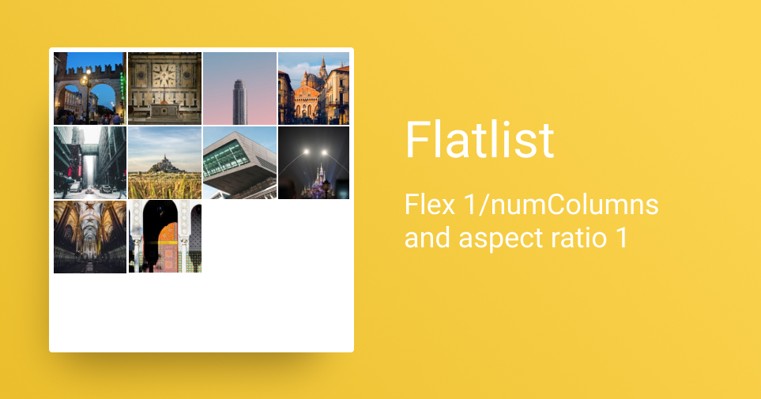

## tl;dr

Use the power of flexbox and aspectRatio to build a dynamic grid which works for all screens and orientations.

## Goal


We want to build a photo grid which is easy to use, supports both portrait and landscape orientation and has configurable columns.

## Flatlist

https://reactnative.dev/docs/flatlist makes it really easy to implement a photo grid. It handles all the hard work of big lists and comes with build in support for columns. We use Flatlist to build our grid.

## Simple Flatlist Example

This is a full app example how to use a Flatlist. [Try it out on expo.io](https://snack.expo.io/@christiankohler/flatlist_blog_simple_example)

```jsx
import * as React from "react";
import { Image, FlatList } from "react-native";

const picsumImages = Array.from(Array(11).keys()).map(
  () => `https://loremflickr.com/320/240`
);

function renderItem({ item }) {
  return <Image source={{ uri: item }} style={{ height: 100 }} />;
}

export default function App() {
  const [images, setImages] = React.useState(picsumImages);
  return <FlatList data={images} renderItem={renderItem} />;
}
```

We only need to provide those attributes to make it work:

- data -> array of items we want to iterate over
- renderItem -> the component we want to render per item

The result is a list of images with a height of 100 and stretched to full width.


## Flatlist with columns

To create a grid from the previous example is straight forward. We only have to define the number of columns:

```jsx
<FlatList data={images} renderItem={renderItem} numColumns={4} />
```

👉 If you coded along you might have noticed that the screen is now white and no images are displayed. The is because we didn't define a width for the individual items.

Let's just add a fixed width for now:

```jsx
<Image source={{ uri: item }} style={{ height: 100, width: 100 }} />
```

The result is a grid. But since the width is fixed to 100 the last image is clipped. [Open in snack.expo.io](https://snack.expo.io/@christiankohler/flatlist_blog_clipped)


## Set tile size with dimension api

One approach to fix the clipping problem is to read the width of the screen and then calculate the the tile width:

```jsx
import { Image, Dimensions } from "react-native";

const screenWidth = Dimensions.get("window").width;
const numColumns = 4;
const tileSize = screenWidth / numColumns;

<Image source={{ uri: item }} style={{ height: tileSize, width: tileSize }} />;
```

The result is a nice photo grid that works. [Here is a working example](https://snack.expo.io/@christiankohler/flatlist_blog_dimension_api)


What I don't like about the solution is that I have to calculate the tile size manually. With my web background I always prefer a fluid solution.

## Set tile size with flexbox

React Native comes with a great support for flexbox. So let's get rid of the dimension api and replace it with flexbox.

```jsx
<Image source={{ uri: item }} style={{ height: 100, flex: 1 }} />
```

So my first approach gives me this result. [Live example](https://snack.expo.io/@christiankohler/flatlist_blog_flex_1)


There are two problems here:

- The height is fixed which breaks the aspect ratio of 1
- If the number of items can not be divided by the number of columns the bottom items are stretched

### Introducing the aspect ratio

The aspect ratio problem is easy to fix. Just remove the height property and define the aspectRatio:

```jsx
<Image source={{ uri: item }} style={{ aspectRatio: 1, flex: 1 }} />
```


[Live example](https://snack.expo.io/@christiankohler/flatlist_blog_aspect_ratio) (Make sure you run it in the simulator since the web view doesn't support the aspectRatio property)

### Using flex with 1/numColumns

There are at least two ways how to fix the stretched bottom items issue:

- Add fake empty items to fill it up
- Use flex 1/numColumns

I want to focus on the flex/numColumns solution.

It's actually pretty simple. Just set the flex to 1/numColumns

```jsx
const numColumns = 4;

<Image
  source={{ uri: item }}
  style={{ aspectRatio: 1, flex: 1 / numColumns }}
/>;
```



[Here is a live example](https://snack.expo.io/@christiankohler/flatlist_blog_num_columns) (Make sure you run it in the simulator since the web view doesn't support the aspectRatio property)

## Summary

Flatlist makes it very easy to build a photo grid with React Native. flexbox helps to create fluid layouts without the need to know the exact dimensions of the screen.

Creating a grid is a very common problem and I hope I could show you an easy and robust way how to do that.

If you liked the article 🙌, spread the word and [follow me on Twitter](https://twitter.com/KohlerChristian) for more posts on React Native, Angular and web technologies.

Did you find typos 🤓? Please help improve the blogpost and open an issue [here](https://github.com/ChristianKohler/homepage)

## Final code

```jsx
import * as React from "react";
import { Image, FlatList, Dimensions } from "react-native";

const picsumImages = Array.from(Array(11).keys()).map(
  () => `https://loremflickr.com/320/240`
);

const numColumns = 4;

function renderItem({ item }) {
  return (
    <Image
      source={{ uri: item }}
      style={{ aspectRatio: 1, flex: 1 / numColumns }}
    />
  );
}

export default function App() {
  const [images, setImages] = React.useState(picsumImages);
  return (
    <FlatList data={images} renderItem={renderItem} numColumns={numColumns} />
  );
}
```
