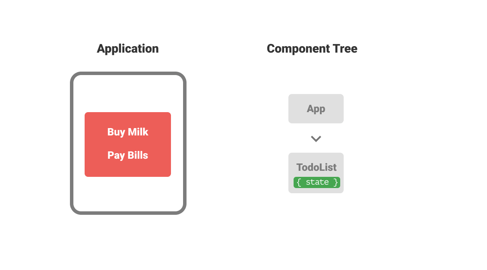
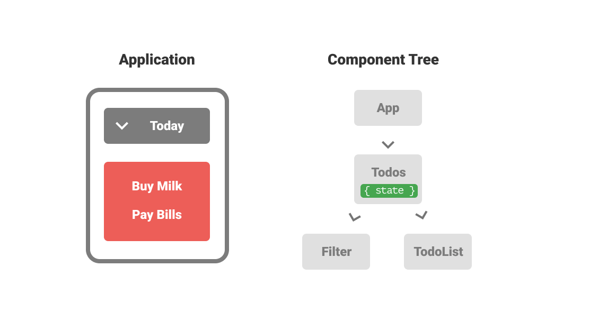
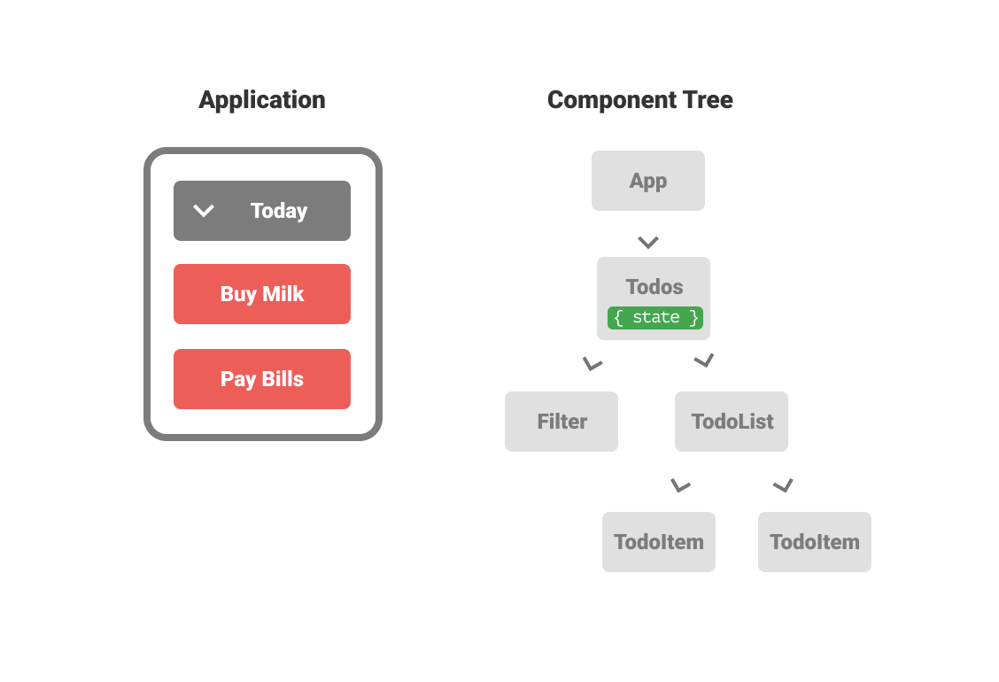
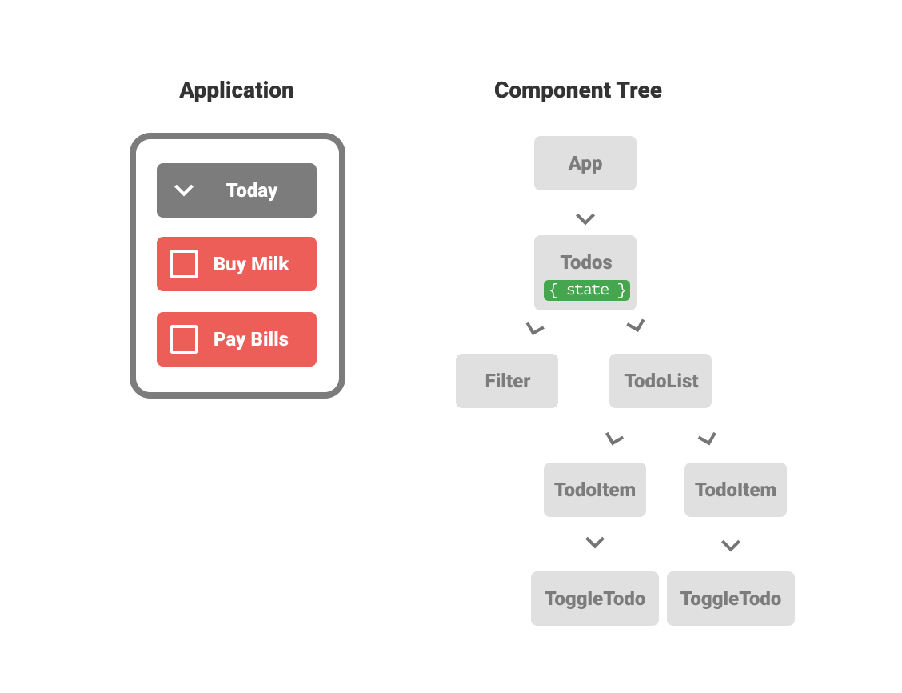
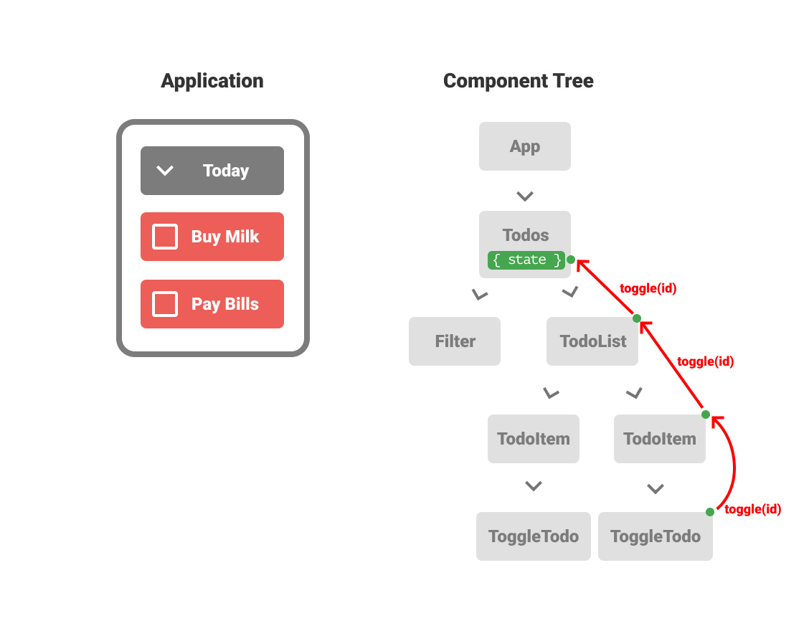
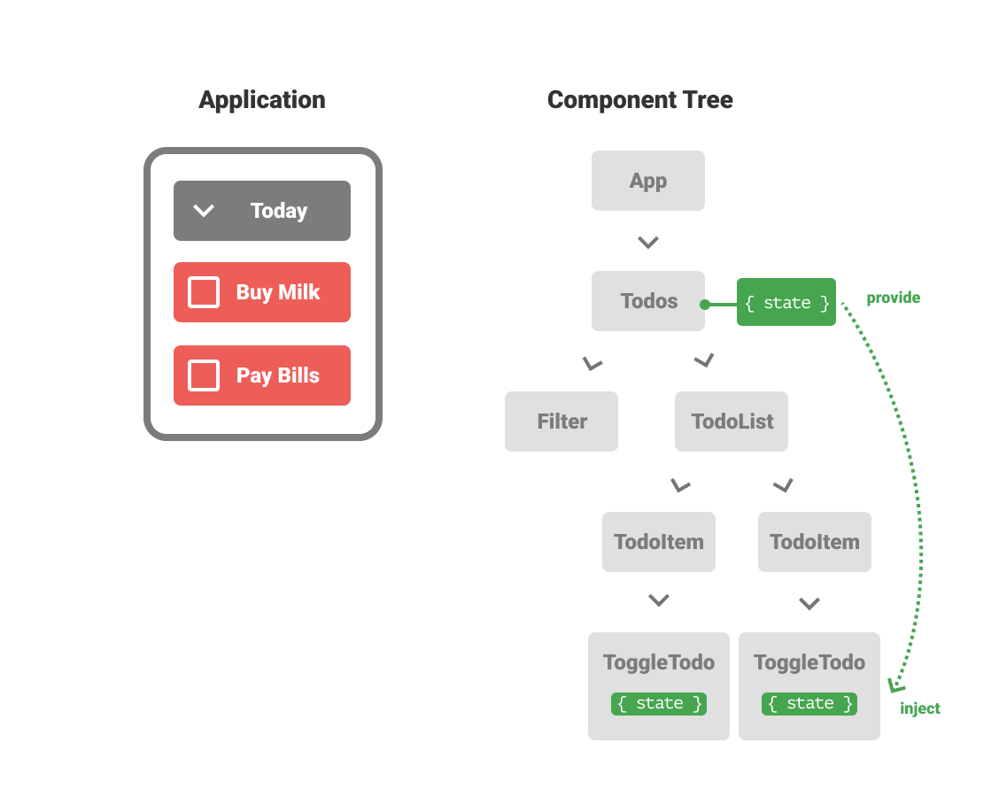

# How to avoid Prop-drilling in Angular

How to avoid Prop-drilling in Angular, or how to apply the idea of React Context to Angular.

## Table of Contents

- Should I be interested?
- The „how“ and the „where“
- What is Prop Drilling?
- The problem of Prop Drilling by example
- How to avoid prop drilling
- Global state vs. Context-like state vs. Prop drilling
- Summary

## Tldr;

If you prefer to use Input/Outputs in Angular you might find yourself writing a lot of boilerplate code to propagate events up the component hierarchy. As a solution you could add that state into a global service.

A better approach is to put the state into a service provided by a component on the highest level necessary. This can be achieved by using the hierarchical dependency injection system of Angular.

## Should I be interested?

If you have all your state in a global store, this article is not for you. But..

- if you try to keep your state and logic as close as possible to where it is used
- and you often end up propagating state and actions through multiple components

..then read on 👇

## The „how“ and the „where“

State management is a broad topic. To make it easier the topic can be divided into two parts. The "how" and the "where".

**The "how"** defines how to handle state. Are you using redux, mobx, ngrx or just a simple class with getter and setter? Is your data immutable or not?

**The "where"** defines whether you have multiple stores / states. For example a common pattern with redux is to have one global store. But it's possible to have local stores or feature stores. State can be within a single component or within a subtree of components.

In this blogpost I don't cover the "how" but look into the "where". I try to keep the examples as simple as possible. That's why I don't use any "fancy" state management library, only pure typescript and a mutable data structure.

## What is Prop Drilling?

Kent C. Dodds wrote a good blog post about [Prop Drilling](https://kentcdodds.com/blog/prop-drilling).

Prop drilling is propagating or threading data through multiple levels of components. Since we don't use props in Angular we could also call it input/output drilling.

## The problem of Prop Drilling by example

Let's look at the problem by writing a small todo app.

Disclaimer: The example is not complete. Some parts might be oversimplified or overengineered.

### Simple List

We start with a simple "one-component" application with a list of todos.

```typescript
@Component({
  selector: "todo-list",
  template: `
    <div *ngFor="let todo of todos">
      {{ todo }}
    </div>
  `
})
export class TodoList {
  todos = ["Buy milk", "Pay bills"];
}
```



### Add a Filter

Now we want to add a filter. Since we want to share our state we create a component called "Todos" which contains the state.



```typescript
@Component({
  template: `
    <todo-filter [(filter)]="filter"></todo-filter>
    <todo-list [todos]="filteredTodos"></todo-list>
  `
})
export class Todos {
  todos = [
    { title: "Buy milk", due: "today" },
    { title: "Pay bills", due: "tomorrow" }
  ];
  filter = "today";

  get filteredTodos() {} // return filtered todos
}
```

### Add a TodoItem Component

Now we want to replace the todo string in the TodoList component with a component. We create a "TodoItem" component for that.



```typescript
@Component({
  selector: "todo-list",
  template: `
    <todo-item
      *ngFor="let todo of todos"
      [todo]="todo"
    ></todo-item>
  `
})
export class TodoList {
  @Input() todos;
}

@Component({
  selector: "todo-item",
  template: `
    <div>{{ todo.title }}</div>
  `
})
export class TodoItem {
  @Input() todo;
}
```

### Add a ToggleTodo Component

Now we want to add another component within "TodoItem" called "ToggleTodo". This component should display a checkbox and call a method named "toggleTodo()" on the state.

Note: For such a simple application this ToggleTodo component definitely is too much component splitting. I do it here to make the problem of prop drilling more visible.



```typescript
/**
 * The toggle event is handled here
 */
@Component({
  template: `
    <todo-filter [(filter)]="filter"></todo-filter>
    <todo-list
      [todos]="filteredTodos"
      (toggle)="toggleTodo($event)"
    >
    </todo-list>
  `
})
export class Todos {
  todos = [
    { title: "Buy milk", due: "today" },
    { title: "Pay bills", due: "tomorrow" }
  ];
  filter = "today";

  get filteredTodos() {} // return filtered todos

  toggleTodo(id: number) {} // handle toggle
}

/**
 * TodoList has to pass the event on
 */
@Component({
  selector: "todo-list",
  template: `
    <todo-item
      *ngFor="let todo of todos"
      [todo]="todo"
      (toggle)="toggle.emit($event)"
    ></todo-item>
  `
})
export class TodoList {
  @Input() todos;
  @Output() toggle = new EventEmitter<number>();
}

/**
 * TodoItem has to pass the event on
 */
@Component({
  selector: "todo-item",
  template: `
    <toggle-todo
      [todo]="todo"
      (toggle)="toggle.emit($event)"
    ></toggle-todo>

    <span>
      {{ todo.title }}
    </span>
  `
})
export class TodoItem {
  @Input() todo;
  @Output() toggle = new EventEmitter<number>();
}

/**
 * The event starts here
 */
@Component({
  selector: "toggle-todo",
  template: `
    <input
      type="checkbox"
      [checked]="todo.done"
      (change)="toggle.emit(todo.id)"
    />
  `
})
export class ToggleTodo {
  @Input() todo;
  @Output() toggle = new EventEmitter<number>();
}
```

As you can see, this leads to a lot of boilerplate since we have to emit the toggle event from component to component.



This is the problem of prop drilling. To set the state from the ToggleTodo we have to go through TodoItem and TodoList.

## How to avoid prop drilling

React has a nice solution for that problem. It's called context.

https://reactjs.org/docs/context.html

> Context provides a way to pass data through the component tree without having to pass props down manually at every level.

Angular doesn't have a functionality like context but we can use its powerful dependency injection system to achieve the same goal.

Note that React's context and Angular's DI are fundamentally different in how the work.

### Angular's hierarchical dependency injection system

Angular comes with a hierarchical dependency injection system. I've [created a infographic poster](https://christiankohler.net/angular-dependency-injection-infographic) to visualise that system.

What you need to know for now is that every component has its own injector and that child components can access the services from further up in the hierachy.

### Todo App with context-like state

So let's use the power of Angular's DI system to create a context for our state.

We are going to provide the state in the Todos component and inject it in the ToggleTodo component.



```typescript
/**
 * Create the state service
 */
export class TodoState {
  todos = [
    { id: 0, title: "Buy milk", done: true },
    { id: 1, title: "Pay bills", done: false }
  ];

  get filteredTodos() {} // return filtered todos

  toggleTodo(id: number) {} // handle toggle
}

/**
 * Provide the TodoState in the Todos component
 */
@Component({
  template: `
    <todo-filter
      [(filter)]="todoState.filter"
    ></todo-filter>
    <todo-list
      [todos]="todoState.filteredTodos"
    ></todo-list>
  `,
  providers: [TodoState] // <--- provide it here
})
export class Todos {
  constructor(public todoState: TodoState) {}
}

/**
 * Use the TodoState in the ToggleTodo component
 */
@Component({
  selector: "toggle-todo",
  template: `
    <input
      type="checkbox"
      [checked]="todo.done"
      (change)="todoState.toggleTodo(todo.id)"
    />
  `
})
export class ToggleTodo {
  @Input() todo;

  /**
   * Inject the TodoState here
   */
  constructor(public todoState: TodoState) {}
}
```

Introducing the TodoState service in this example reduced the boilerplate of propagating the toggle event from component to component. It's a nice way to reduce boilerplate without the need to throw the state into the "global bucket".

## Global state vs. Context-like state vs. Prop drilling

I think there is a place for all concepts, even in the same application.

Personally I try to start with Inputs/Outputs. It is easier to follow and refactor (like a pure function) and change detection is also easier to understand.

When I feel that the added boilerplates negates the benefits of Inputs/Outputs I switch to context-like state services. This reduces boilerplate but still keeps the state as close as possible to where it is used.

Some state is global. One common example is the selected theme. In this case I'd use a global service like this one:

```typescript
@Injectable({
  providedIn: "root"
})
export class ThemeProvider {
  selectedTheme = "light";

  selectLightTheme() {
    this.selectedTheme = "light";
  }
  selectDarkTheme() {
    this.selectedTheme = "dark";
  }
}
```

You might ask yourself why not make everything global. In small applications like the todo example from this post, putting the state into a global service is fine. But the more complex you application is, the more important it is to keep your logic and state as close as possible to where you use it.

## Summary

In this blog post you learned that there is not just global or local state in Angular. With the power of the hierarchical DI system we can provide a state service in the the exact (highest) place in the component tree where we need it to be. This is often a nice compromise between having a local state and making it globally available.

If you liked the article 🙌, spread the word and [follow me on Twitter](https://twitter.com/KohlerChristian) for more posts on web technologies.

Did you find typos 🤓? Please help improve the blogpost and open an issue [here](https://github.com/ChristianKohler/homepage)
