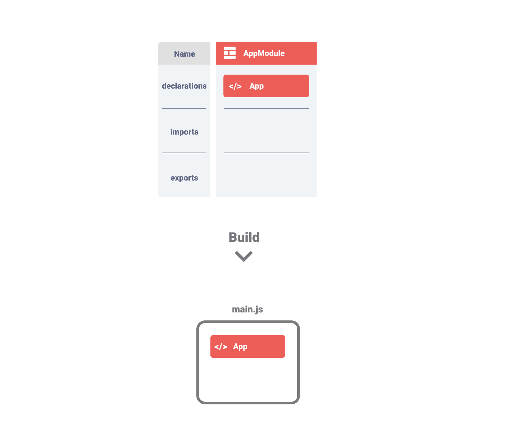
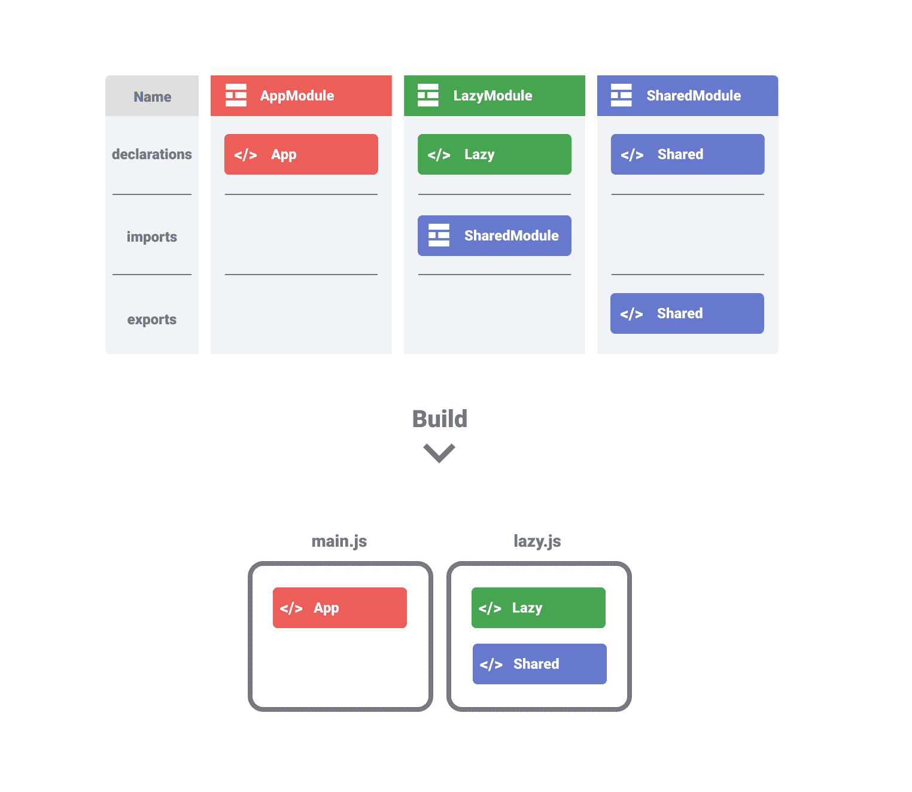

# Bundling Angular Modules

NgModules are controversial. They make it harder getting started with Angular. They might become [optional in the future](https://angular.io/guide/roadmap#simplified-angular-mental-model-with-optional-ngmodules). But today they are here and it is helpful to understand how they work and how you can use them to write modular and performant applications. With the recent updates, especially with Ivy, NgModules became less intrusive and easier to use. In this blogpost I want to give you an overview what you need to know about NgModules in the Ivy world.

## Table of Contents

- Tldr;
- Why do we need NgModules?
- How small / big should a module be?
- How modules are bundled
- Summary

## Tldr;

- Today NgModules are mainly used to register components, directives and pipes
- There are two types of NgModules: Eagerly loaded and lazy loaded modules
- Eagerly loaded modules are always bundled in the main bundle
- Lazy loaded modules have their own bundle file
- Shared modules are optimised and bundled with the best available bundle

## Why do we need NgModules?

With Ivy, one of the main reasons we need NgModules is to register components, directives and pipes. When Angular parses a template it needs to know how to compile a component.

Every framework has this challenge. React uses JSX, Vue solves it with a components property on the component:

```javascript
var ComponentA = {
  /* ... */
};

var ComponentB = {
  components: {
    "component-a": ComponentA
  }
  // ...
};
```

Angular solves it with the declaration property on @NgModules:

```typescript
@Component({
  selector: "component-a",
  template: "hello"
})
export class ComponentB {}

@Component({
  selector: "component-b",
  template: "<component-a></component-a>"
})
export class ComponentB {}

@NgModule({
  declarations: [ComponentA, ComponentB]
})
export class MyModule {}
```

The Angular compiler uses that information and adds all registered components which are used to the component definition. Actually the directives array in the compiled component looks somehow similar to Vue's approach with the components definition.

In a simplified example, ComponentB would be compiled to this:

```typescript
// template: <component-a></component-a>
class ComponentB {}

ComponentB["ɵcmp"] = ɵɵdefineComponent({
  template: function(rf, ctx) {
    ɵɵelement(0, "component-a");
  },
  directives: [ComponentA] // <- register ComponentA
});
```

With that, Angular makes sure that:

1. The component is included in the bundle since it is referenced
2. The component template can compile it's child components

### Other use cases

- The AppModule is also responsible to define how the application is bootstrapped.
- Even though most providers nowadays can be defined without NgModules it is still a solution for more complex scenarios.
- In pre-Ivy applications, entryComponents needed to be defined. Not required anymore in the Ivy-world.
- Additional schemas can be defined. For example to use custom elements with Angular

## How small / big should a module be?

Without thinking about bundle optimisation and test isolation, it's totally up to your preference. You can define a NgModule per component or have a bigger module for many components. Both ways are totally fine.

## How modules are bundled

Angular knows two kind of NgModules:

- Eagerly loaded modules
- Lazy loaded modules.

The AppModule is always loaded eagerly and lazy modules can be loaded when we navigate to a lazy route. That way the browser doesn't need to load the full application initially.

The way we define NgModules has an affect on the resulting JavaScript bundle files.

Let's have a closer look.

### Component not declared

If you don't declare a component in a NgModule, the component is not bundled. Luckily the compiler throws an error in that case.


### Most simple example

The most simple example is a single module and a single component declared. In that case, as you would expect, the component is bundled in the main JavaScript bundle.



### Separate EagerModule

Every eagerly loaded module is bundled in the main JavaScript bundle. Eagerly loaded modules are always defined in the AppModules import array or in a transitive module (e.g. AppModule <- EagerModule <- OtherModule).


### Lazy loaded Modules

A lazy loaded module is not directly imported via the imports array but is defined within the router configuration.

```typescript
const routes: Routes = [
  {
    path: "lazy-route",
    loadChildren: () =>
      import("./lazy.module").then(m => m.LazyModule)
  }
];
```

That way the module is only loaded when the user navigates to this page. Angular creates a separate JavaScript bundle for the lazy loaded module.


### Shared modules

If a shared module is only imported in a lazy loaded module, it is bundled in the lazy bundle.



If the shared module is imported in both, an eager loaded module and a lazy loaded module it is only bundled in the main bundle.


If the shared module is imported in two lazy loaded modules (but not in an eagerly loaded module) a common bundle is generated for the shared code and loaded together with the first lazy loaded module.


### Noteworthy

As you can see, Angular is very clever to split the application in multiple bundles. What you need to know though:

- If you import a module, all components are bundled, even if not all are used.
- The smaller the modules the better Angular can optimise the bundles

## Summary

NgModules are required to register components, directives and pipes. All eagerly loaded NgModules are bundled in the main bundle. Lazy loaded modules all have a separate bundle. Shared modules are bundled in an optimal way to not load them too early.

If you liked the article 🙌, spread the word and [follow me on Twitter](https://twitter.com/KohlerChristian) for more posts on web technologies.

Did you find typos 🤓? Please help improve the blogpost and open an issue [here](https://github.com/ChristianKohler/homepage)
