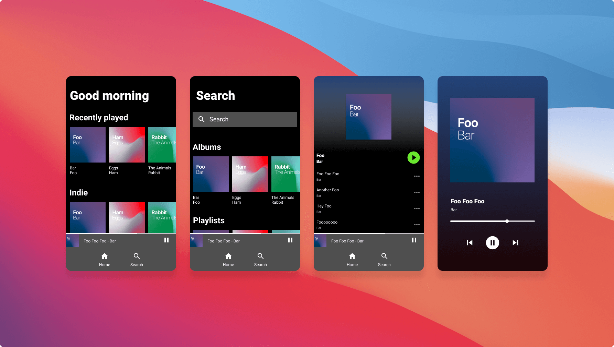
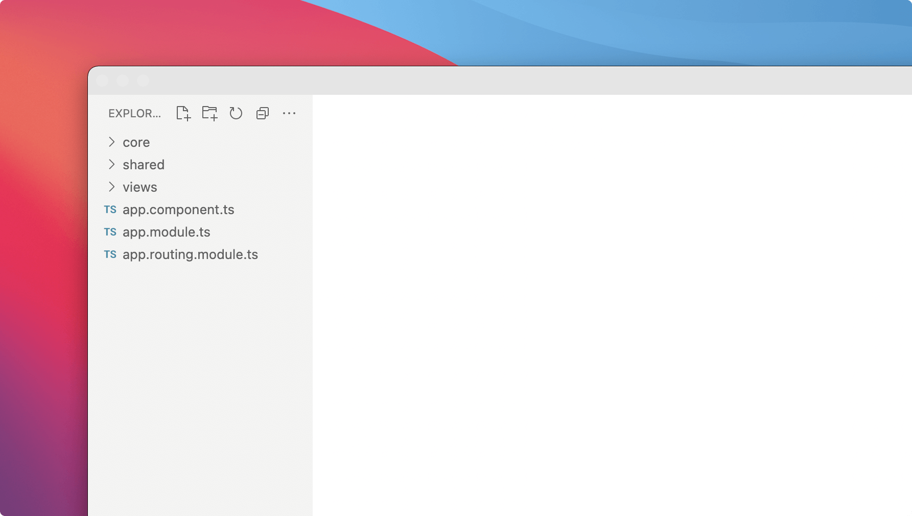
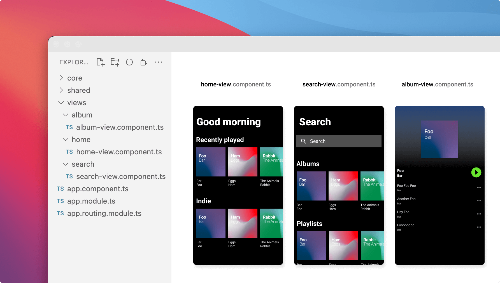
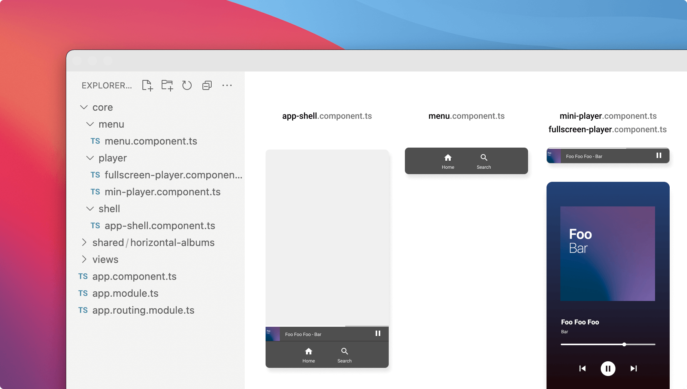
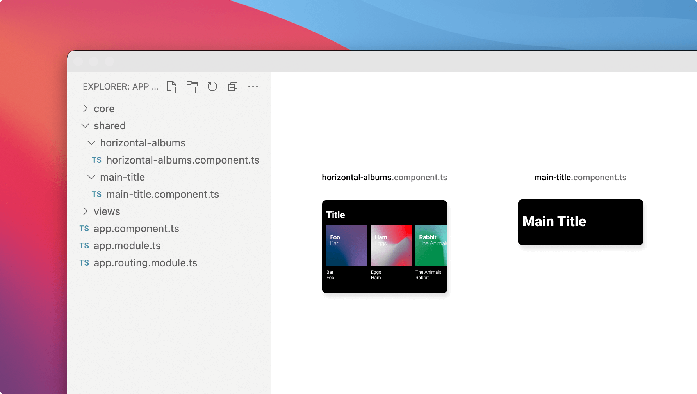
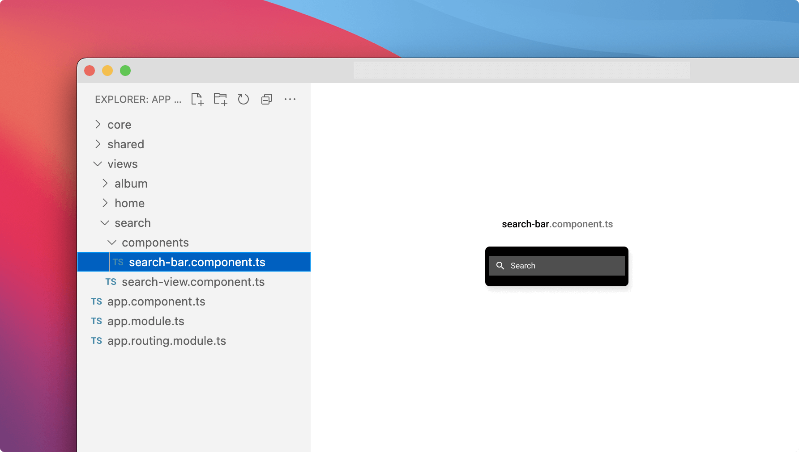
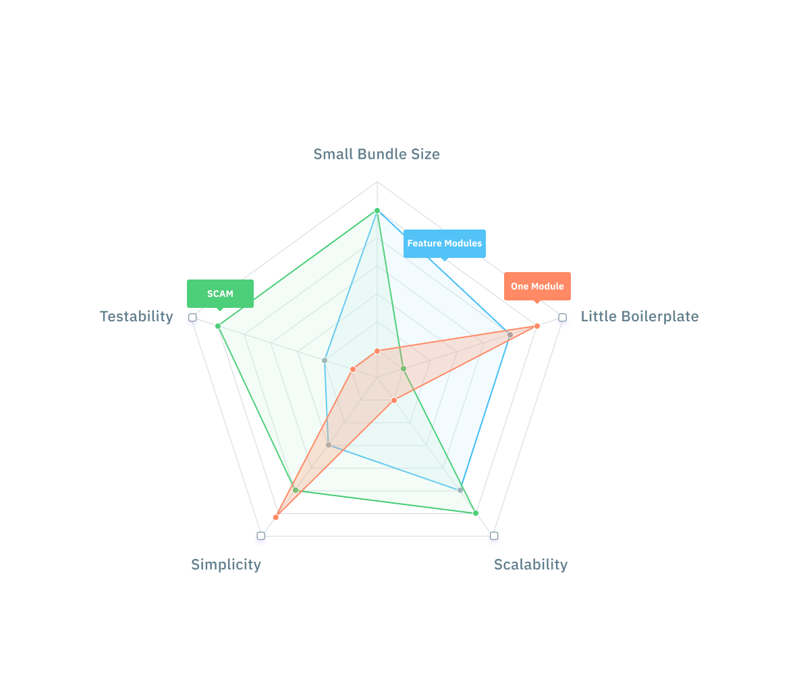
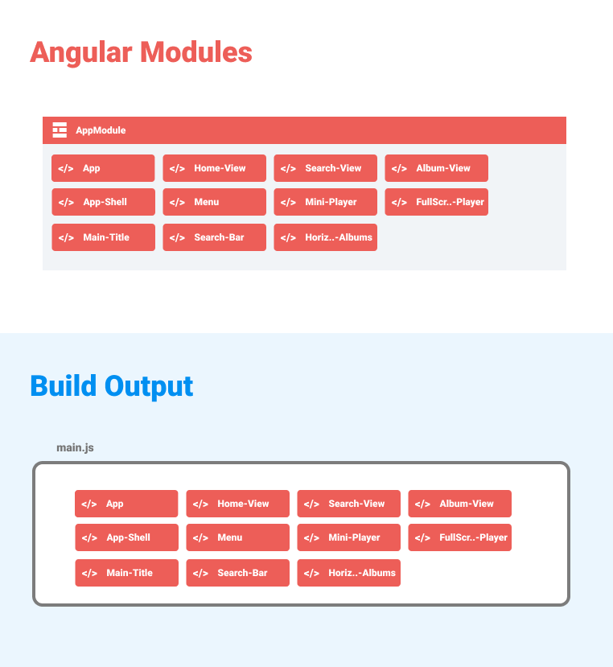
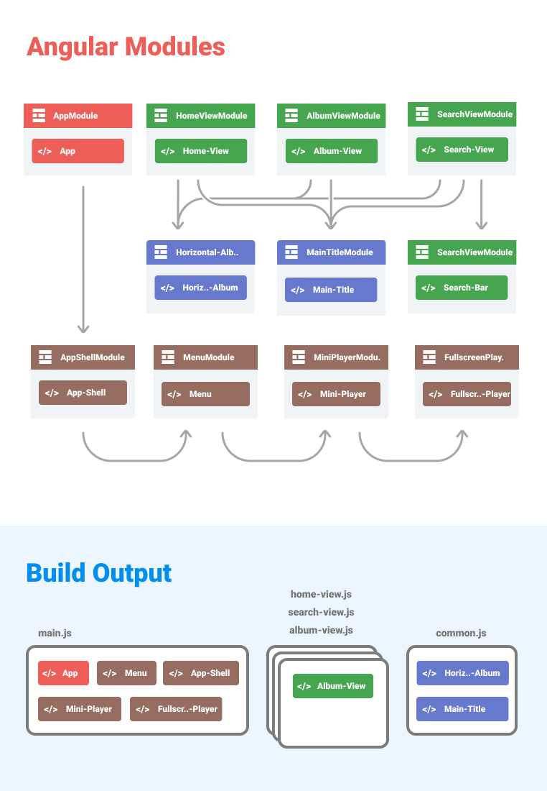
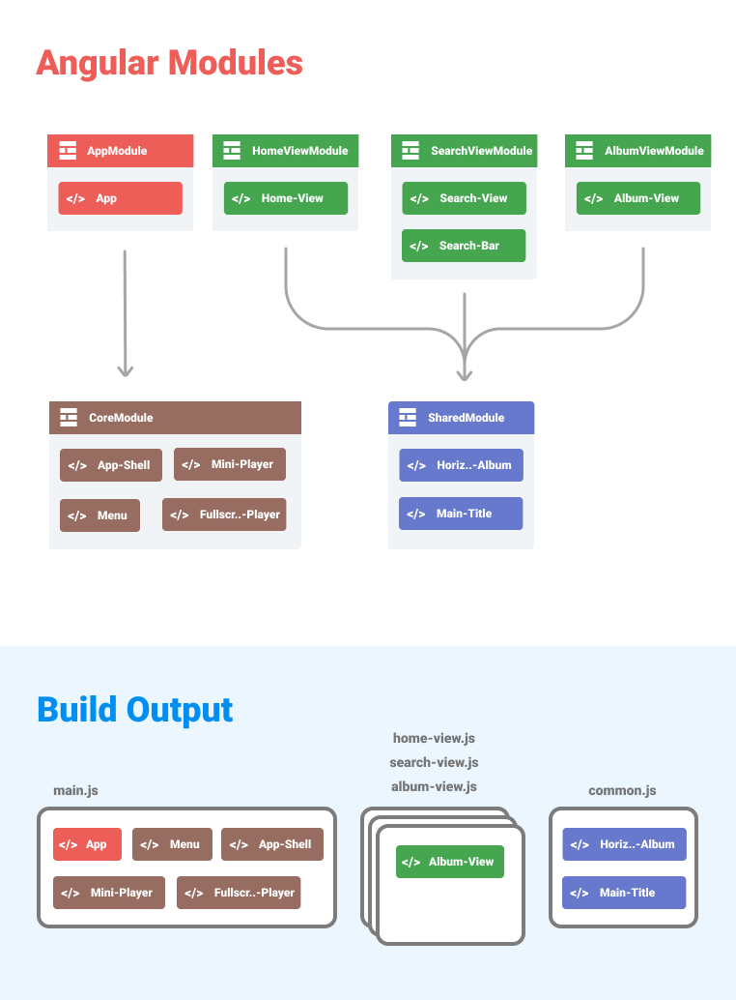

Angular Modules are used to organize an application and consolidate components, directives, and pipes into blocks of functionality.

A good strategy can improve code organization, optimize the bundle size and make it easy to extend and refactor an application. A bad strategy can lead to dependency hell and larger bundles than necessary.

In this blog I will cover different strategies and give you tips on how to choose a strategy for your application.

## Table of Contents

- TLDR;
- Example Application
- Aspects
- Strategies
- Summary

## TLDR;

I use various aspects like bundle size, scalability, simplicity, and boilerplate to compare different module strategies.

The outcome is that there is not a single strategy for all types of applications but this post should help you in the decision-finding process for which strategy to choose.

## Example Application

I will show you how I would organize an application. It is neither a simple counter nor a large enterprise app. So it might not fit your app size but I think it is a good structure to start a new app.

We take a music player as an example application. This should be a very familiar application to most of you. It has a global player reachable at the bottom and a few views to find and browse songs.

### Folder Structure

Let’s forget about angular modules for a moment and let’s see how we can structure our application.

> Folder structure and code organization are subjective and depend on the app you are working on. This is only an inspiration for how you could structure your app.

I use three main folders:

- core
- shared
- views

**Views** contains the 3 views we can route to:

- home-view
- search-view
- album-view

**Core** contains all the components which need to be available when the app starts. This includes the shell and the bottom menu. Also part of the core is the mini-player and the fullscreen player.

**Shared** contains all the components which are shared between the views. In our example we have two shared components:

- horizontal-albums
- main-title

**View Specific Components** is one folder (type) I didn’t mention at the beginning. Some components are reused in different views, some are only used in one view. Keeping code as close as possible to where it is used is a good practice. Therefore we place components that are only used in one view into that view folder. In this example that would be the search-bar which is only used in the search view.

## Use Angular Modules

Angular Modules can now be used to combine those components into modules. There are many ways how to slice an app into Angular modules and there is no right or wrong way.

### Aspects

There are a few aspects we should consider when deciding on one or the other approach.

**Bundle size** can be affected by how the modules are sliced. It can be the overall bundle size or also the individual lazy loaded bundles. This impacts the loading time of your app in a browser.

**Scalability** is about how easy it is to navigate and make changes in your code. Depending on how you slice your application, reorganization of code can be more difficult.

**Simplicity** is about how easy it is for someone in the team to understand when and where to create an Angular module.

**Boilerplate** How much boilerplate do we need for our Angular modules? The more modules the more boilerplate. This can usually be resolved by generating boilerplate with a CLI or an IDE.

**Testabilty** How easy is it to test a single component? If the component is part of a large module, we may have to mock many services.

### Strategies

There are 3 strategies I want to have a closer look at today:

- Everything in one module
- One module per feature / view (Lazy Load)
- One module per component (SCAM)

All strategies have their pros and cons. The radar chart compares the different approaches visually.

**One module for all components** is very simple. Whenever we create a component, we add it to the app.module declaration.

This approach is very simple but has a few downsides:

- All components are eagerly loaded which results in a longer initial load time
- The app.module file gets bloated and refactoring means touching this file all the time
- Resolving dependencies is a nightmare. For example, it is very hard to figure out what we can remove after deleting a component. Maybe a component was only used in the deleted component and miss to remove that one as well.

This approach might work for very small applications but I wouldn’t recommend it for bigger projects.

**One module per component (SCAM)** is the exact opposite of the previous approach. In this strategy, we create a single module for every component. SCAM is an abbreviation for “Single Component Angular Module”. Lars Gyrup Brink Nielsen coined the term in [this blog post](https://dev.to/this-is-angular/angular-revisited-tree-shakable-components-and-optional-ngmodules-36d2).

What I like about this approach is that it is much easier to understand which dependencies a component has. Each component module only imports the modules it directly uses. That means if we remove a component we also remove all its dependencies automatically. Nice.

Another benefit of this approach is that Angular can build the optimal bundles for lazy loaded routes thanks to the clear dependency tree.

And last but not least, the rule is very simple: Every component has its module. That’s it, no discussions about how to slice the modules.

The only downside I see is that it adds some boilerplate since we have more module definitions and we have to import all dependencies explicitly. But that might change in the future with a new API on the @Component decorator which allows standalone components (without NgModules). For more on that, you can follow that [spike on Github](https://github.com/angular/angular/pull/42831).

**One module per feature / view (Lazy Load)** is probably the most common pattern.

We get the optimal bundle size when we load all the view lazy. Since the shared module is used in multiple lazy loaded modules, it gets loaded in a separate common module. For more details on that, I wrote a blog post about how Angular bundles modules. [Bundling Angular Modules](https://christiankohler.net/bundling-angular-modules).

This pattern is somewhere in the middle of the two other approaches. We get small bundle sizes with little boilerplate and we still have a clear structure.

If your application is larger you can also split the modules again into smaller feature modules or bundle views together into bigger feature bundles. This can either help you organize your code or lead to confusion on when to create those sub-modules. Angular has a in depth [documentation](https://angular.io/guide/module-types) on how that.

## How to decide what pattern to use?

The easiest decision is to rule out putting everything into one single module. If the application has routes and has more than 10 components, don’t go with that strategy.

To decide between the view/feature module and the single component module you have to ask yourself:

> How much boilerplate are you willing to add for a clear dependency tree and a simple rule to follow?

Going with the classic feature/view module approach is still my go-to approach as long as the feature module imports and declarations are manageable.

If you build a library, the SCAM strategy is perfect since it allows the library consumer to only import the components they use. It is also good if you have difficulties defining a good strategy due to its simple rules.

Both SCAM and the classic feature/view module approach result in the same bundle structure. So both are very good from a performance perspective. However, this is only the case as long as we do not accidentally import a feature module in the app or core module, which does not happen with SCAM.

## Summary

In this blog post, you learned different module strategies and various aspects like bundle size, scalability, simplicity, and boilerplate which helps you to decide on a strategy.

The three strategies I've shown here are the ones I mainly see and know. If you use another strategy, let me know, maybe I'll have to update the blog post soon with a new strategy 🙃

If you liked the article 🙌, spread the word and [follow me on Twitter](https://twitter.com/KohlerChristian) for more posts on web technologies.

Did you find typos 🤓? Please help improve the blogpost and open an issue [here](https://github.com/ChristianKohler/homepage) or post your feedback [here](https://github.com/ChristianKohler/Homepage/discussions/19)
