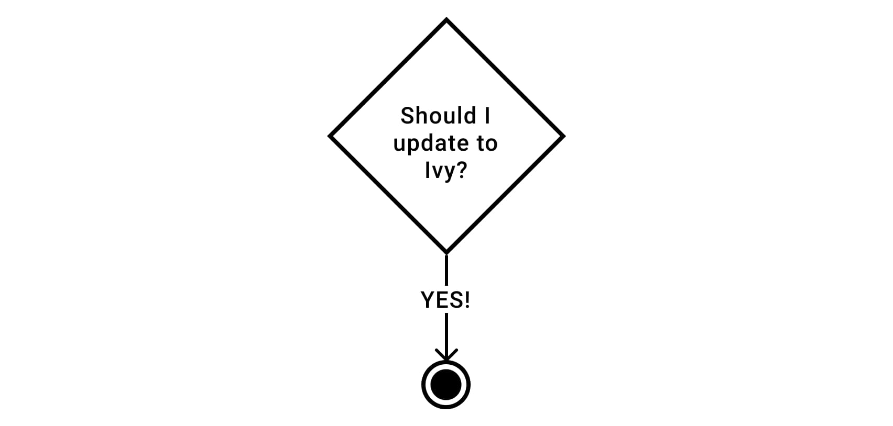

## Table of Contents

- Intro
- TLDR;
- What changed with Angular 13?
- FAQ

## Intro

Angular 13 was released this month. One of the most important updates is the removal of its deprecated rendering engine View Engine. [Read the full release blog post here.](https://blog.angular.io/angular-v13-is-now-available-cce66f7bc296)

> **View Engine** is no longer available in Angular as of v13

So, how are Angular developers affected by this change?

Let's have a look 👇

## TLDR;

If you are an **application developer** using Ivy, nothing has changed for you. You are using Ivy which is great. All libraries you depend on still work. For View Engine libraries, ngcc is still here. If you still use the View Engine, now it is definitely time to upgrade.

If you are a **library developer**, the recommended way of publishing since version 12 is with "Partial Ivy". With Angular 12, it was still an option to publish with the View Engine instead. This is not possible anymore with Angular 13.

## What changed with Angular 13?

### Next Milestone to "Ivy Everywhere"

Angular is transitioning its rendering engine. Away from View Engine over to Ivy. With Angular 13 we hit an important milestone of this transition with the removal of View Engine.

This process started with an Ivy preview in version 8 and Ivy as the default rendering engine with version 9.

One of the main challenges in this transition is how Angular library developers can update to the new Ivy world without breaking existing View Engine applications.

### For application developers


Angular removed the View Engine. If you haven't changed to Ivy yet, now you have to.

Angular 13 still supports libraries published with both rendering engines. That means nothing has changed from 12 to 13. We still rely on ngcc for libraries published with View Engine.

### For library developers

For library developers, especially the ones who publish to npm, the goal was always to support both engines during the transition. This was achieved by publishing in the View Engine format. View Engine apps could therefore still use it and Ivy apps had to run ngcc to make it compatible.


With Angular 13, it is not possible to publish in the View Engine format anymore. Library developers have now two options to publish:

- Partial Ivy
- Full Ivy

So what is the difference?

### Partial Ivy

This is the default when Angular CLI creates a library project. It creates an intermediate format. Since it is only partially compiled it is compatible with any Angular versions higher than 12. It gets fully compiled when the app is built. More on this in this [in-detail blog post here](https://blog.lacolaco.net/2021/02/angular-ivy-library-compilation-design-in-depth-en/).

### Full Ivy

Fully compiled Ivy code. Not recommended when publishing the library. Use it in your application workspace where all apps and libs share the same Angular version.

## FAQ

### What is the impact of changing from View Engine to Ivy?

The View Engine format is compatible with both, View Engine and Ivy apps. Ivy apps require ngcc to make it work though.

Changing to "Partial Ivy" makes your library incompatible with View Engine apps. And that is ok! App developers had almost 2 years to migrate to ivy and therefore most applications nowadays use ivy. Minko gives a good overview in [this blog](https://blog.angular.io/upcoming-improvements-to-angular-library-distribution-76c02f782aa4) post how most applications use ivy today.

The advantage of publishing with Ivy is that application developers don’t have to run ngcc anymore (given that all the libraries they depend on changed from View Engine to Ivy) 🎉

### How to set the format for a library?

The Angular CLI sets it automatically to "partial" when you create a new library. It is set in the `tsconfig.lib.prod.json` config file.

Note: Although "partial" is set by default by the Angular CLI (v13), if the compilationMode is not set, it [defaults](https://angular.io/guide/angular-compiler-options#compilationmode) to "full".

```json
// projects/my-lib/tsconfig.lib.prod.json
{
  "angularCompilerOptions": {
    "compilationMode": "partial" | "full"
  }
}
```

### How to call ngcc?

There are two ways how ngcc can be called:

1. Automatically on every build
2. Manually in a postinstall script

```json
// package.json
"scripts": {
   "postinstall": "ngcc"
}
```

If you are using the second option, now is a good time to remove the manual step and let Angular do the magic. Fewer libraries will depend on ngcc.

## Summary

The transition from View Engine to Ivy goes well. Angular 13 doesn't bring much change for most developers but it is another milestone towards a simpler Angular world with only Ivy and no View Engine.



Did you like the article? Please spread the word 🙌 and [follow me on Twitter](https://twitter.com/KohlerChristian) for more posts on web technologies.

Did you find typos 🤓? Please help improve the blogpost and open an issue [here](https://github.com/ChristianKohler/homepage) or post your feedback [here](https://github.com/ChristianKohler/Homepage/discussions)

## Resources

- [Understanding Angular Ivy Library Compilation | lacolaco/tech](https://blog.lacolaco.net/2021/02/angular-ivy-library-compilation-design-in-depth-en/)
  [Angular](https://angular.io/guide/creating-libraries#building-libraries-with-ivy
- [Upcoming improvements to Angular library distribution | by Minko Gechev | Angular Blog](https://blog.angular.io/upcoming-improvements-to-angular-library-distribution-76c02f782aa4)
