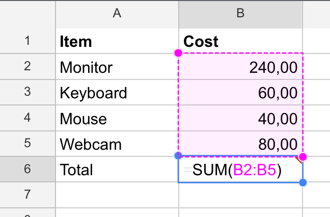

## Table of Contents

- Intro
- TLDR;
- What is a computed property?
- Computed properties in Angular
- Summary

## Intro

Many frameworks and libraries have built-in support for computed properties.

For example Svelte:

```javascript
let firstName = „Chris“;
let lastName = „Kohler“;
$: fullName = `${firstName} ${lastName}`;
```

Or Vue:

```javascript
computed: {
  fullName() {
    return `${this.firstName} ${this.lastName}`
  }
}
```

Or MobX:

```javascript
class TodoList {
    @observable firstName = „Chris“
    @observable lastName = „Kohler“

    @computed
    get fullName() {
        return `${firstName} ${lastName}`;
    }
}
```

So if you are coming from a framework that has a computed keyword, you might be wondering how to define computed properties in Angular.

## TLDR;

There is no computed keyword or decorator in Angular. But there are many ways how to define computed properties in Angular. If you are already using observables, just use `pipe(map)`. Otherwise, `getters` and `pipes` are a good way to define computed properties.

## What is a computed property?

A computed property is a value that is derived from state.

For example, if you have a spreadsheet with a list of purchases and one line with the total cost, the purchases are state and the total cost is derived state.



The advantage of defining computed properties is that when you change the state, the computed property is automatically updated. In this example when you change the cost of an item or add/remove an item, the total will be updated automatically.

## Computed properties in Angular

There is no computed keyword or decorator in Angular. But that doesn‘t mean it is not possible to define computed properties. In fact, there are multiple ways to define them. Let‘s have a look at them.

We go through the following ways:

- ngOnChanges
- getters
- pipe
- RxJS
- ngrx/component-store

### Computed properties in "dumb" / presentational components

In this post, I focus on "dumb" components with computed properties. That's where I most often use those patterns. For smart / container components I often use a state management library with built-in support for computed properties. That said, all the approaches can also be used for container components.

### Example App

We use this simple interface for all the examples:

```typescript
interface Todo {
  name: string;
  done: boolean;
}
```

In the examples, we implement the `todo-stats` component with the different approaches. The component is then used in the AppComponent as shown below:

```typescript
@Component({
  template: `
    <!-- Display: "Todos done: 5" -->
    <todo-stats [todos]="todos"></todo-stats>
  `,
  selector: "my-app"
})
export class AppComponent {
  todos: Todo[] = [
    { name: "shop", done: false },
    { name: "clean", done: true },
    { name: "travel", done: true }
  ];
}
```

Also, all implementations can use this helper function to filter todos by the status "done":

```typescript
function byDone(todo: Todo): boolean {
  return todo.done;
}
```

### Approach with ngOnChanges

```typescript
@Component({
  template: `
    Todos done: {{ done }}
  `,
  selector: "todo-stats"
})
export class TodoStatsComponent implements OnChanges {
  @Input() todos: Todo[] = [];

  done = 0;

  ngOnChanges(): void {
    this.done = this.todos.filter(byDone).length;
  }
}
```

`ngOnChanges` is triggered when an `@Input` changes. Whenever this happens we make sure to update the done count.

This approach is simple and easy to understand. But only for small examples like this one. When the component grows, it is more difficult to see how the `done` property depends on `ngOnChanges`. This approach can also be error-prone since we have to always remember to update the `done` property whenever we change the `todos`. I try to avoid this approach for derived state. That said, in cases where I have many inputs it can be a good option to orchestrate.

- ✅ Simple and easy to understand
- ✅ Good for multiple inputs
- ⚠️ Can be error-prone with a more complex components

### Approach with a getter

```typescript
@Component({
  template: `
    Todos done: {{ done }}
  `,
  selector: "todo-stats"
})
export class TodoStatsComponent {
  @Input() todos: Todo[] = [];

  get done() {
    return this.todos.filter(byDone).length;
  }
}
```

Compared to the ngOnChanges, this approach has a few advantages. First, we see directly how `done` is derived. Second, we never have to remember to update the `done` property when changing the `todos`.

This approach is very close to how we write formulas in a spreadsheet. One downside is, that every time the component is rerendered, the `done` property is recomputed. In this example, it is fine if the component is only rerendered when the `todos` array changes. This can be easily achieved by changing the change detection to `OnPush`.

I like the readability of getters and use is often for components where I don't have any observables and only 1-2 inputs.

What about perfomance? You might think that this approach is bad for performance because there is no caching. That's true, there is no caching. But in components with 1-2 inputs it is very likely that you anyway always have to update the derived property. Caching also adds some overhead and is not generally necessary for every computation.

- ✅ Derived state is clearly defined
- ✅ Getters is a fundamental language feature, no new concept to learn

### Approach with an Angular Pipe

```typescript
@Pipe({ name: "numberOfDoneTodos" })
export class DoneTodosPipe implements PipeTransform {
  transform(todos: Todo[]): number {
    return todos.filter(byDone).length;
  }
}

@Component({
  template: `
    Todos done: {{ todos | numberOfDoneTodos }}
  `,
  selector: "todo-stats"
})
export class TodoStatsComponent {
  @Input() todos: Todo[] = [];
}
```

I like this approach for the very clear separation of concerns. Another plus is that (pure) pipes are cached by default. That means that property is no recomputed if the input didn't change

- ✅ Clear separation
- ✅ Build in cache (pure pipes)

### Approach with RxJS

```typescript
@Component({
  template: `
    Todos done: {{ done$ | async }}
  `,
  selector: "todo-stats"
})
export class TodoStatsComponent {
  @Input() set todos(todos: Todo[]) {
    this.todos$.next(todos);
  }

  todos$ = new BehaviorSubject<Todo[]>([]);

  done$ = this.todos$.pipe(
    map(todos => todos.filter(byDone).length)
  );
}
```

The reactive approach. This is my go-to solution if I am already in the RxJS world. Very powerful with many operators out of the box. For our simple example it might be overengineered but for more complex logic RxJS helps a lot to write clean code.

- ✅ Recommended when part of the state is already in the RxJS world (observables)
- ✅ Very powerful with many operators out of the box

### Approach with ngrx/component-store

```typescript
@Component({
  template: `
    Todos done: {{ todosDone$ | async }}
  `,
  selector: "todo-stats",
  providers: [ComponentStore]
})
export class TodoStatsComponent {
  @Input() set todos(todos: Todo[]) {
    this.todosStore.setState(todos);
  }

  todosDone$ = this.todosStore.select(
    todos => todos.filter(byDone).length
  );

  constructor(
    protected todosStore: ComponentStore<Todo[]>
  ) {}
}
```

Bonus approach. I see this approach as a variant of the RxJS approach. If you often use the RxJS approach, using the `ngrx/component-store` library can be a nice addition. ComponentStore is a standalone library that helps to manage local/component state and comes with methods like `setState` or `select`.

You can start with a generic store like I do in this example. When you see the component gets too complex, it is easy to extract the store and define selectors in the store instead of in the component itself.

- ✅ Recommended as an alternative to the RxJS approach
- ✅ Nice refactor options
- ✅ `select` is in my opinion more readable than `pipe(map)`

## Summary

There are many ways how to define computed properties in Angular. There is no right or wrong. I use almost all the approaches in my apps, often many approaches in the same app.

Here is how I choose between the approaches.

1. If I am not using observables I either use the `getter` or `pipe` approach.
2. If I am already using observables in a component, I stay in the RxJS world with either pure RxJS or ngrx/component-store.
3. I rarely use `ngOnChanges` to update derived state.

Do you have another approach? Let me know on [Twitter](https://twitter.com/KohlerChristian)

## Spread the word

Did you like the article? Please spread the word 🙌 and [follow me on Twitter](https://twitter.com/KohlerChristian) for more posts on web technologies.

Did you find typos 🤓? Please help improve the blogpost and open an issue [here](https://github.com/ChristianKohler/homepage) or post your feedback [here](https://github.com/ChristianKohler/Homepage/discussions)
