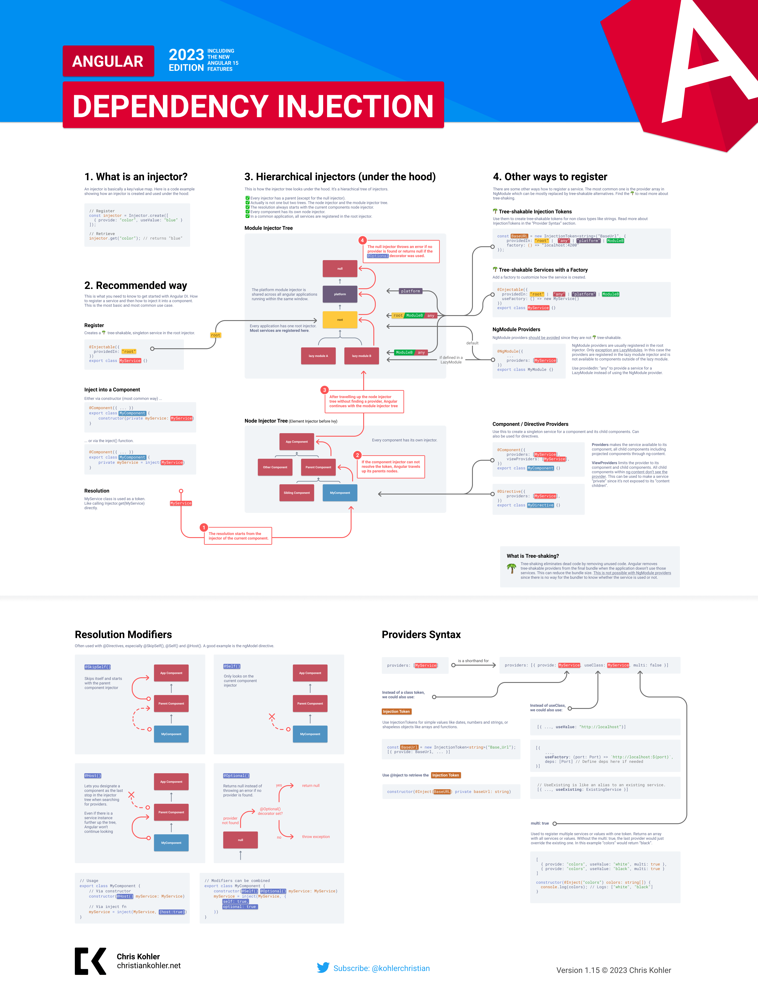

Angular has its own dependency injection framework. It's very powerful and helps increase the efficiency and modularity of your application. It can also be quite complex when compared to traditional DI frameworks.

I created a [infographic for Angular dependency injection](https://chriskohler.dev/angular-dependency-injection-infographic) a while ago. Now I updated the infographic with the latest features up to Angular 15.

## Updates with Angular 14

With Angular 14 a new feature was released that allows us to inject providers using the `inject()` function instead of using the constructor class.

So how can we use the new functionality? Lets says we have the following service defined:

```typescript
@Injectable({
    providedIn: “root”
})
export class MyService {}
```

Traditionally we injected the service via constructor:

```typescript
@Component({ ... })
export class MyComponent {
    constructor(myService: MyService) {}
}
```

With Angular 14 we can also inject the service via `inject()` function:

```typescript
@Component({ ... })
export class MyComponent {
    myService = inject(MyService);
}
```

If you want to learn more about the inject function and why and when to use it I can recommend the following blog posts:

- [Unleash the Power of DI Functions in Angular - Netanel Basal](https://netbasal.com/unleash-the-power-of-di-functions-in-angular-2eb9f2697d66)

- [Angular Inject & Injection Functions -Younes Jaaidi](https://marmicode.io/blog/angular-inject-and-injection-functions)

## Documentation

[The official documentation](https://angular.io/guide/dependency-injection) is very well written and a must read for every Angular developer. The only thing missing for me was a good graphical overview. This is why I created this infographic poster.

👩‍🚀 Protip: 🖨 Print your DI poster and hang it in the toilet. Within a few weeks your work colleagues are DI experts 😀

✅ Also feel free to use the poster for education purposes like workshops or in classes.

👆 It took me hours to complete this cheatsheet. If you like it follow me on [twitter](https://twitter.com/kohlerchristian) and spread the word 🙌

🤓 Did you find a mistake? Please help improve the infographic and open an issue [here](https://github.com/ChristianKohler/homepage)

[Download Angular DI Infographic as PDF](./angular-di-infographic_v115.pdf)



[Download Angular DI Infographic as PDF](./angular-di-infographic_v115.pdf)
