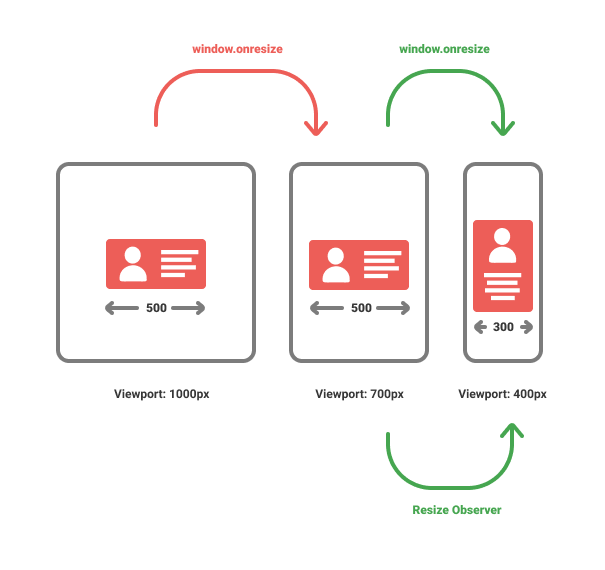
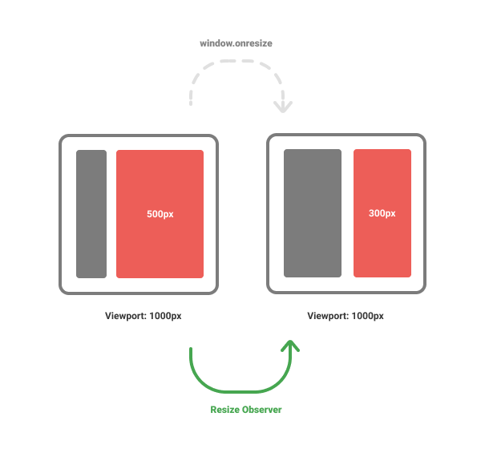
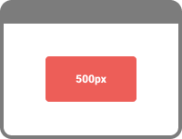

# tl;dr

Sometimes we need to execute JavaScript when an element is resized.

Current solutions are **based on the viewport dimension**, **not** on **element dimensions**.

ResizeObserver is a new API which allows us to react to element resizing. 

There are a few steps required to use it properly with Angular. You have to make sure:

* to unobserve on destroy
* that change detection is triggered

I found it to cumbersome to do it on every component. That's why I've created a library to simplify the usage with Angular. 🚀

# ✨React to element dimension changes

Many changes in screen size or element size can be handled with pure CSS. But sometimes we **need to know when an element is resized** and execute some logic in JavaScript.

This is usually implemented with either `window.onchange` or `matchMedia`. Both solutions are based on the viewport dimension, not the element dimension.

ResizeObserver [ResizeObserver - Web APIs | MDN](https://developer.mozilla.org/en-US/docs/Web/API/ResizeObserver) is a new API to solve exactly this problem. In this article we will have a look at how it works and how we can use this new API together with Angular.

Let's start with why we need a new API.

# 💣 What's the problem with window.onchange?

We are only interested in events where our component changes its width. Unfortunately window.onchange sometimes fires **too often** or **not at all**.

## onchange fires too often

This happens when the viewport changes but our component doesn't. Do you see the first window.onresize (colored in red)? We are not interested in this event. Running to much code on every onresize could lead to performance problems.



## onchange doesn't fire (but should)

This happens when the viewport doesn't change but the elements within change.

**Examples**

- New elements are added dynamically
- Elements are collapsed or expanded (e.g. Sidebar)

In the graphic below the viewport doesn't change and the sidebar gets expanded. The ResizeObserver triggers but the window.onresize doesn't.



Now that we know why we need the new ResizeObserver Api we will take a closer look at it.

# 🚀 ResizeObserver in a nutshell

Here is an example on how to use ResizeObserver to subscribe to a resize event of an element.

You can observe multiple elements with one ResizeObserver. That's why we have an array of entries.

```javascript
const observer = new ResizeObserver(entries => {
  entries.forEach(entry => {
    console.log("width", entry.contentRect.width);
    console.log("height", entry.contentRect.height);
  });
});

observer.observe(document.querySelector(".my-element"));
```

This is how an entry looks like:

```json
{
  "target": _div_,
  "contentRect": {
    "x": 0,
    "y": 0,
    "width": 200,
    "height": 100,
    "top": 0,
    "right": 200,
    "bottom": 100,
    "left": 0
  }
}
```

Since we subscribed to an observer, we need to unsubscribe as well:

```javascript
const myEl = document.querySelector(".my-element");

// Create observer
const observer = new ResizeObserver(() => {});

// Add element (observe)
observer.observe(myEl);

// Remove element (unobserve)
observer.unobserve(myEl);
```

That's ResizeObserver in a nutshell. For a full overview of what you can do with ResizeObserver, check out [ResizeObserver - Web APIs | MDN](https://developer.mozilla.org/en-US/docs/Web/API/ResizeObserver)

# 🏁 Status ResizeObserver

At the time of writing (Feb 2020), ResizeObserver is a EditorsDraft [Resize Observer](https://drafts.csswg.org/resize-observer-1/). This means it is still in a very early phase [World Wide Web Consortium Process Document](https://www.w3.org/2015/Process-20150901/#maturity-levels)

Chrome and Firefox support ResizeObserver, Edge and Safari don't. A ponyfill is available.

# 🛠 How to use it with Angular

Let's create a component which displays its width.



## 1: Create the component

```typescript
@Component({
  selector: "my-component",
  template: "{{ width }}px"
})
export class MyComponent {
  width = 500;
}
```

## 2: Add Observer

Now let's observe the nativeElement of our component and log the current width. Works like a charm (in Chrome and Firefox 😉)

```typescript
export class MyComponent implements OnInit {
  width = 500;

  constructor(private host: ElementRef) {}

  ngOnInit() {
    const observer = new ResizeObserver(entries => {
      const width = entries[0].contentRect.width;
      console.log(width);
    });

    observer.observe(this.host.nativeElement);
  }
}
```

## 3: Trigger change detection

If you are following this example you may have tried to bind the width directly to the class property. Unfortunately the template is not rerendered and keeps the initial value.

The reason is that Angular has monkey-patched most of the events but not (yet) ResizeObserver. This means that this callback runs outside of the zone.

We can easily fix that by manually running it in the zone.

```typescript
export class MyComponent implements OnInit {
  width = 500;

  constructor(
    private host: ElementRef, 
    private zone: NgZone
  ) {}

  ngOnInit() {
    const observer = new ResizeObserver(entries => {
      this.zone.run(() => {
        this.width = entries[0].contentRect.width;
      });
    });

    observer.observe(this.host.nativeElement);
  }
}
```

## 4: Unobserve on destroy

To prevent memory leaks and to avoid unexpected behaviour we should unobserve on destroy:

```typescript
export class MyComponent implements OnInit, OnDestroy {
  width = 500;
  observer;

  constructor(
    private host: ElementRef, 
    private zone: NgZone
  ) {}

  ngOnInit() {
    this.observer = new ResizeObserver(entries => {
      this.zone.run(() => {
        this.width = entries[0].contentRect.width;
      });
    });

    this.observer.observe(this.host.nativeElement);
  }

  ngOnDestroy() {
    this.observer.unobserve(this.host.nativeElement);
  }
}
```

Want to try it out? [Here is a live example](https://stackblitz.com/edit/angular-resize-observer-example?file=src%2Fapp%2Fapp.module.ts).

## 5: Protip: Create a stream with RxJS

```typescript
export class MyComponent implements OnInit, OnDestroy {
  width$ = new BehaviorSubject<number>(0);
  observer;

  constructor(
    private host: ElementRef, 
    private zone: NgZone
  ) {}

  ngOnInit() {
    this.observer = new ResizeObserver(entries => {
      this.zone.run(() => {
        this.width$.next(entries[0].contentRect.width);
      });
    });

    this.observer.observe(this.host.nativeElement);
  }

  ngOnDestroy() {
    this.observer.unobserve(this.host.nativeElement);
  }
}
```

> Follow me on 🐦 [twitter](https://twitter.com/KohlerChristian) for more blogposts about Angular and web technologies

# ☀️ Use ng-resize-observer to simplify the usage of ResizeObserver

💻 https://github.com/ChristianKohler/ng-resize-observer

📦 https://www.npmjs.com/package/ng-resize-observer


1. Install `ng-resize-observer`
2. Import and use the providers
3. Inject the NgResizeObserver stream

```typescript
import { NgModule, Component } from "@angular/core";
import {
  ngResizeObserverProviders,
  NgResizeObserver
} from "ng-resize-observer";

@Component({
  selector: "my-component",
  template: "{{ width$ | async }} px",
  providers: [...ngResizeObserverProviders]
})
export class MyComponent {
  width$ = this.resize$.pipe(
    map(entry => entry.contentRect.width)
  );

  constructor(private resize$: NgResizeObserver) {}
}
```

**NgResizeObserver** is created per component and will automatically unsubscribe when the component is destroyed. It's a RxJS observable and you can use all operators with it.

Want to try it out? [Here is a live example on Stackblitz](https://stackblitz.com/edit/ng-resize-observer-simple-example)

# Make the web resizable 🙌

ResizeObservers allow us to run code exactly when we need it. I hope I could give you an overview over this new API. 

If you want to use it in your Angular application, give **ng-resize-observer** a try and let me know what you think.

If you liked the article 🙌, spread the word and [follow me on twitter](https://twitter.com/KohlerChristian) for more posts on Angular and web technologies.